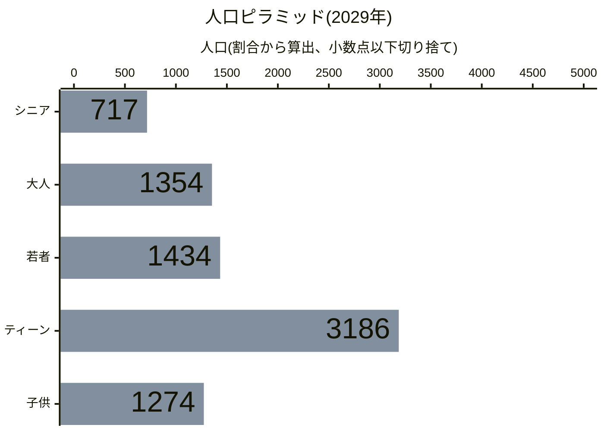
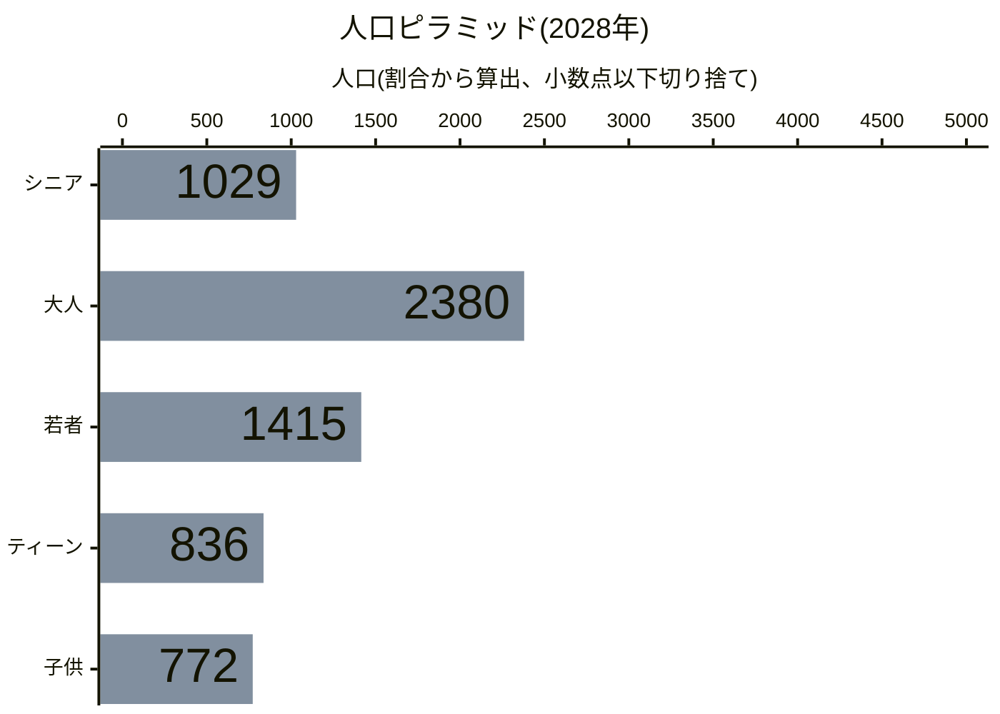
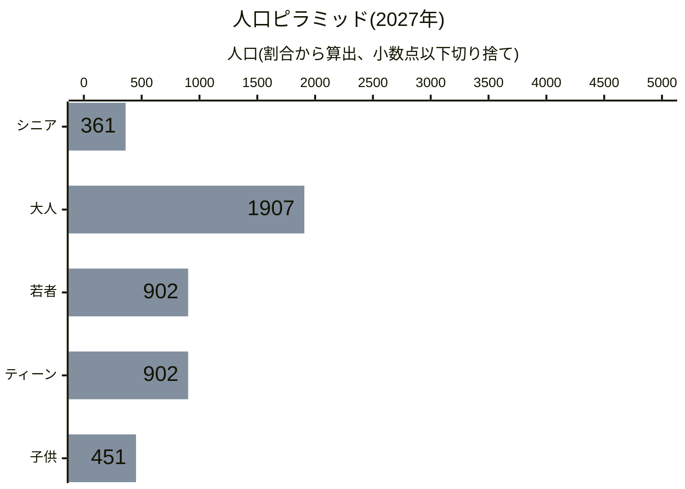
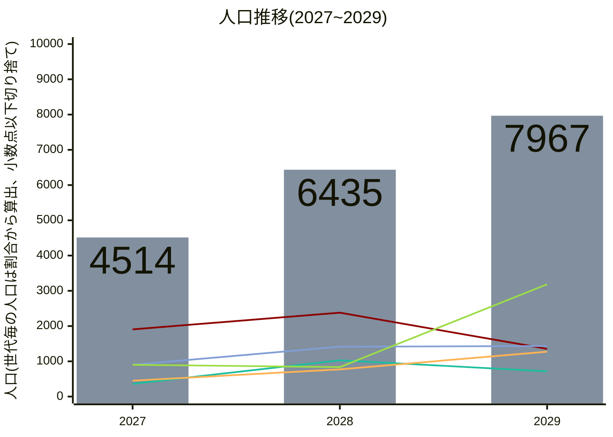
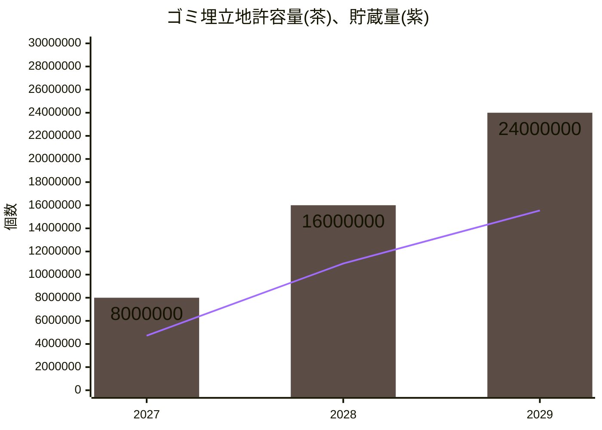
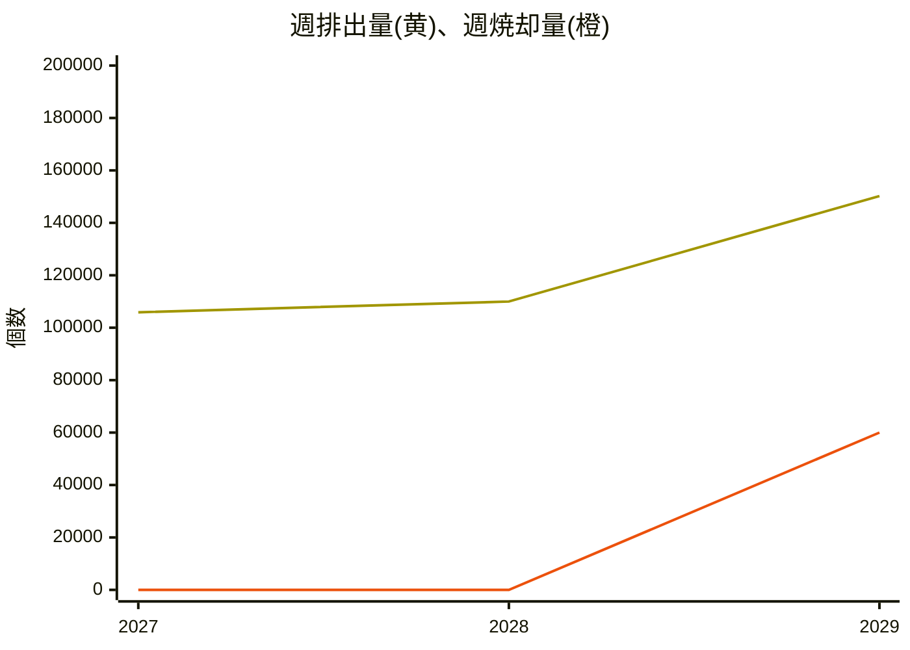

# 澳北市都市計画主要計画

市告示第01K6PPN7DZSNF121QXZE59ZM0N号 2027年7月12日

<!--ULIDと日付の更新を忘れずに！-->

## 目次
- [都市計画にあたって](#都市計画にあたって)  
  - [計画目的](##計画目的)  
- [関連計画](#関連計画)  
- [現状分析](#現状分析)  
  - [自然環境](##自然環境)  
  - [人口](##人口)  
  - [産業・経済](##産業・経済)  
  - [土地利用](##土地利用)  
  - [公共施設](##公共施設)  
  - [交通](##交通)  
- [計画構想](#計画構想)  
  - [課題と対策](##課題と対策)  
  - [発展ビジョンと構想](##発展ビジョンと構想)  
- [計画原則](#計画原則)  
- [計画内容](#計画内容)  
  - [土地使用計画](##土地使用計画)
  - [公共施設計画](##公共施設計画)
  - [都市交通計画](##都市交通計画)

## 都市計画にあたって
この度澳北市では、継続して発展し、市民の皆様により住みやすいまちであり続けるため、まちづくりの基本的な指針となる「澳北市都市計画主要計画」を策定しました。これは、2025年ごろから2期にわたって行われた澳北市域開発による課題の顕在化や、状況の変化を踏まえ策定したものです。

今回の策定にあたっては、澳北市の四方を囲む高速道路網をはじめとする関連計画を踏まえたまちづくりの基本的方針を明らかにするとともに、既存の澳北市街の開発成果を踏まえ、新たな施策展開の方向性についても定めています。

今後、澳北市が目指す将来都市像である「Fetish Preference Diver-City 澳北」、誰もが好きを見つけられる住みよいまち澳北の実現を目指し、市民や関係者の皆様とともに都市基盤整備やまちづくりを推進してまいります。

### 計画目的
本計画の計画目的は以下の通りです。
1. 交通渋滞の解消、及び防止による都市機能の維持と改善
2. 公共サービスの不足解消による都市機能の修繕

## 関連計画
本計画の関連計画について、計画区域の四方を囲む高速道路については県告示第01K6N3CXY9DVDTV9WG7D5N2HK3号「豊嶼連絡高速道路整備計画」、計画区域の南部及び西部の鉄道路線については鉄総貨第01K6N3KHH5D2W2MYTH92G43FY0号「澳豊貨物線基本計画」を参照してください。

## 現状分析
### 自然環境
#### 水資源
計画区域においては中西部から南方にかけて竜骨川が流れており、西部のポンプ場が澳北市の水源となっています。他方、南部の排水管からは澳北市の生活・工業排水が排水されているものの、排水は未浄化の状態で排水されており、澳北市南方への汚染が深刻な問題となっています。

|水資源情報|
|:-:|
|  |

#### 天然資源
計画区域においては北西部、並びに南部を中心に疎らに森林資源が分布しており、その利用可能な資源量は週9,482トンであると見込まれます。

また、北東辺縁部には5ヘクタールの肥沃地が存在しますが、現状では工業区として利用しているほか、市境を跨いでいることから開発は困難であり、現状農地としての利用はできていません。

|天然資源情報|
| :-: |
| <table><thead><tr><th style="text-align:center;">資源種別</th><th style="text-align:right;">利用可能資源量</th><th style="text-align:right;">開発済資源量</th></tr></thead><tbody><tr><td style="text-align:center;">原油 鉱石 森林資源 肥沃地</td><td style="text-align:right;">0  t 0  t 週 9,482  t 5 ha</td><td style="text-align:right;">0  t 0  t 週 0  t 0 ha</td></tr></tbody></table> |
|   |

<!-- html化してテーブル内に埋め込み、ネスト化
| 資源種別 | 利用可能資源量 | 開発済資源量 |
| :-: | -: | -: |
| 原油 鉱石 森林資源 肥沃地 | 0  t 0  t 週 9482  t 5 ha | 0  t 0  t 週 0  t 0 ha |
-->

#### 地形
計画区域においては全般的に平坦で、開発に適しています。また、中央からやや北部、並びに北西辺縁部に若干標高の高い地域が見られ、風力発電に適しています。
|標高情報|
|:-:|
|   |

### 人口
計画区域においては現人口が4,514名、出生数が週28名、死者数が週4名。人口の82%が生産人口です。

また、計画区域の北西部に位置する開発第1期の開発地域と、中西部に位置する第2期の開発地域で世帯構成が変化しており、第1期開発地域では入居から年数が経っていることがあり成人中心の世帯構成に、第2期開発地域では入居から間もないために家族中心の世帯構成となっています。

また、人口に占める初等教育の修了率は27%、中等教育の修了率は18%となっており、高等教育機関の設置と、高等教育修了者に向けた雇用の創出、産業の誘致が将来的に課題となる可能性があります。

|人口情報|
|:-:|
|    |

最新のデータを年代別に人口ピラミッドとして描画すると以下の通りです。

<!--グラフを更新したら画像の更新も忘れずに！-->
[グラフをご覧になれない環境の方向け画像リンク](https://mermaid.ink/img/pako:eNplkM9v0zAUx_-V6HHYkJLKTtwm9YFLd0SCEweWHdzWbSOlceW6ol1VaW0EW6nQdgBx4IAEjB8H0ARIsIL4Z9xs-zNwmg6QeIen97X9Pu_rN4aGaHKg4DhOmDRE0oraNEwsE8NRrcOk2qg8Grm-IyOeKKYikVBrqyNktC-Mjrf-vut3xIMdpthtVucxtZQc8OJSdXiX32MyYvWY9_8h_z8rj14sVE3EQt5lMVeKm3k3Ahy0qi0zbG04TIajtasNP1Ixt0JYLZfZ8WudPtXpB52-1Gmq0_m2i9xqdv71ZgibDzpsGPWt3RD07JtOF3r2KgTbtGdv3hlCUV8tTq8OHha1Th_pmcH-1OmXzcuPJ6tfL0LYK4ijgnhtYDubf85OjvTUoOeXn55nh0t9MM3Oji-enV3Ozlc_TlffF9nRoZ49vnjyXk_fGmsWshznllVGCBXMOpPWro9928JemZhMPJM9HFRM7fpkD2xoy6gJNN-zDV0uuyyXMM4BIayXHgI1ZZO32CBW-QImpq3HkvtCdK87pRi0O0BbLO4bNeg1meI7EWtL1v1zKnnS5LImBokC6pM1A-gYhkAJ8krIR6RcRrjieySwYQQUe7hUwQFyMSG4EiDiT2zYX09FJZ8gF_lVH2HiehVSnvwG-iHr-w?type=png)

昨年以前の人口ピラミッド

<!--グラフを更新したら画像の更新も忘れずに！-->
[グラフをご覧になれない環境の方向け画像リンク](https://mermaid.ink/img/pako:eNplkM9u00AQxl9lNRxaJDvatZ3Y2QOX9IgEJw7UPWySTWLJ8UabjUgaRWpiQRsi1B5AHDggAeXPAVQBEjQgXmbjto_BOk4BiTnNtzvz-2ZmDA3R5EDBtu0waYikFbVpmCATw1Gtw6TaqDwaub4jI54opiKRULTVETLaF0bHW3_r-h3xYIcpdpvVeUyRkgNefKoO7_J7TEasHvP-P-T_vfLoxULVRCzkXRZzpbjxuxGQoFVtGbP1wGEyHK2n2vAjFXMUwmq5zI5f6_SpTj_o9KVOU53Otx3sBNn515shbBa02TDqo90Q9OybThd69ioEy7Rnb94ZQpFfLU6vDh4WuU4f6ZnB_tTpl03lx5PVrxch7BXEUUG8HmA7m3_OTo701KDnl5-eZ4dLfTDNzo4vnp1dzs5XP05X3xfZ0aGePb548l5P35rREEa2fQuVMcYFs84k2iXYqVrIcQNsIeKRsoUCt2Ih33f2wIK2jJpA8zNb0OWyy3IJ47w_hPXNQ6AmbfIWG8Qq339i2nosuS9E97pTikG7A7TF4r5Rg16TKb4TsbZk3T-vkidNLmtikCigPl4zgI5hCNTDbgn72CuXMan4rhdYMAJKXFKqkAA7xPNIJcCeP7Fgf-2KS76HHexXfUw8x6145clvHt_rww?type=png)

<!--グラフを更新したら画像の更新も忘れずに！-->
[グラフをご覧になれない環境の方向け画像リンク](https://mermaid.ink/img/pako:eNplkM9v0zAUx_8V63HYkJLKTtOk9YFLd0SCEweWHdzGbSOlceW6ol1VaW0EW6nQdgBx4IAEjB8H0ARIsIL4Z9xs-zNwmg6QeAfrfe33_bznN4amCDlQsG07SJoiaUVtGiTIxHBU7zCpNiqPZq7vyIgniqlIJBRtdYSM9oXR8dbfun5HPNhhit1mDR5TpOSAF4-qw7v8HpMRa8S8_w_5_1559GKh6iIW8i6LuVLc9LtRJdVWrWWarQcOkuFoPdWGH6mYowBWy2V2_FqnT3X6QacvdZrqdL7tYMfPzr_eDGDzQZsNoz7aDUDPvul0oWevArCMPXvzzhCK_GpxenXwsMh1-kjPDPanTr9sKj-erH69CGCvII4K4vUA29n8c3ZypKcGPb_89Dw7XOqDaXZ2fPHs7HJ2vvpxuvq-yI4O9ezxxZP3evrWjIYwsu1bqIIxLpgNJtFu2SMWIjXsW6iGnc3hVsgeWNCWUQg0X7IFXS67LJcwzt0BrDceADVpyFtsEKv89xNj67HkvhDda6cUg3YHaIvFfaMGvZApvhOxtmTdP7eSJyGXdTFIFFDPWzOAjmEI1MXlEvaxW6lg4vllt2rBCCgpk5JHqtghrku8Knb9iQX766645LvYwX7Nx8R1yp5bmfwGa6jrXQ?type=png)

 

また、統計開始時からの人口の推移は以下の通りです。

<!--グラフを更新したら画像の更新も忘れずに！-->
[グラフをご覧になれない環境の方向け画像リンク](https://mermaid.ink/img/pako:eNplUr1u2zAQfhXiMiQFJIOUKFHU0MUZO3TqUCsDbVG2AFkyZBm1a7iovSRpkKRL2wcI2mZKgk6p_Tiy7NcoaTuBi9xAfHcfv_sjx9DKQgk-mKYZpK0sjeK2H6RI2XBU74i82Hna-p3sw7EoxBvRlImPinwgt2TRkV35TuSxaCayv6d4mUNbL8mKepZk-VuRyKKQPjo88IgX8chAB6TVlFwq4IVYmQaEy9BRgLfCkDIFoqhpOfZhkG66DtLhqKXL7JqJi0SiAJbzeXV9s7q6Xf9eHFnYYp_UwV8FsBvPFMO4jxoBaC4AA22Q94x4ACfbq6Pt1aeUR8vH78vFzer-qpzebUPl9L46_1N9PSunF-XsfH33ozqdl5-n1cP16tvDevZ3ufi5fLyozk7L2ZfV5W05_aUaQRiZ5mtE9JzbSk2RowZ1CDWQS201M-Mu23WRxKls2C4xlMDiiiL_MYRjtRrL9tTKiO3QfY5jSwUpcfRpv6Q82zWQTTx3n1FtqCJMKy1GT8CAdh6H4OtnN6Ar867QLoy1JoDNHwjAVzCUkRgkhd70RMl6In2fZd0nZZ4N2h3wI5H0lTfohaKQx7Fo56L7HM1lGsq8ng3SAnzX2uQAfwxD8Cm2a5hh6jiYuMymngEj8IlNai7xsEUoJa6HKZsY8HFTFdcYxRZm3MOEuBbhbPIPnCv02Q?type=png)

### 産業・経済
計画区域内工業区においては、364トンを市外から輸入、498トンを市外へ輸出しており、輸入品目は石油が最多、次いで鉱石、農産物、木材、商品となっており、輸出品目は全量が商品となっています。

|輸入情報|輸出情報|
|:-:|:-:|
|   |   |

### 土地利用
計画区域においては北西部に工業区、中西部に住宅区、商業区の土地利用構成となっています。

|土地利用情報|
|:-:|
|  |

### 公共施設
#### 警察
計画区域においては澳北IC付近に1箇所の警察署が設置されており、市内の犯罪発生率は7%となっており、良好な治安を維持しています。反面、留置場は定員20名に対し留置中18名となっており、留置能力の不足が課題となっています。
|警察情報|
|:-:|
|   |

#### 消防
計画区域においては澳北IC付近に1箇所の消防署が設置されており、市内の災害発生率は60%とやや高くなっています。特に、現状開発されている区域の南西部における消火能力の不足、災害発生率の高止まりは著しくなっています。

|消防情報|
|:-:|
|   |

### 医療・葬儀
計画区域においては1箇所の診療所が設置されており、平均健康度は70%、病床数100に対し入院中患者は1名と、良好な公衆衛生を維持しています。また、同区域内に1箇所の墓地が設置されており、3000体の埋葬が可能なキャパシティに対して現在の埋葬数は32体と、現時点では余裕を持った墓地運営を実現しています。

|医療情報|葬儀情報|
|:-:|:-:|
|   |   |

|警察情報|
|:-:|
|   |

#### 廃棄物処理
計画区域においては1箇所のゴミ埋立地が設置されており、59%が使用済みです。現在、澳北市では廃棄物の処理方法を埋め立てに頼っており、希望的観測としてこのままのペースで廃棄物が排出された場合、2029年9月には埋立地の使用率が100%となり、新たな埋立地を必要とする見込みです。

|廃棄物処理情報|
|:-:|
|   |

また、統計開始時からのゴミ埋立地の許容量、貯蔵量、週排出量の推移は以下の通りです。

<!--グラフを更新したら画像の更新も忘れずに！-->
[グラフをご覧になれない環境の方向け画像リンク](https://mermaid.ink/img/pako:eNplkL9u2zAQxl-FuAxpACmgGP0zhy7O2KFTh5oZaImyBVCkQVOoXcNA2g4dXKBLuxXIGiBAmhZpgT6P4cZ9i4qSEgTITb_77u47HleQ6VwABd_3mcq0KsoJZQo1sVgOp9zYPnMxn-o3p9zyF3wsJEXW1KIr2qmoxCtuSj6WYv5o4qmHi5nUdqilNi-5FNYKig4PonGYhZGHDjiJs6JwEAxijBsQWRTg7JCp9o1MLZaZM-1Xl1YKxGD7_nb74WJ3sbm72uy-3ewvf-yu__z7-PnZ_tPvo-35u_3P7_svv5xwd3t1xKC_0eeLco5GDAgmCQMPtZQ-0IDBWde67FoZ7M43f7_eMEAY-f5zdIK76LrG3KBR2ikeCuJ7ImFHvZkslRiFCenb8CDuKYrCuOEz8GBiyhyo-2QPKmEq7lJYOQMG7Y8zoA3mouC1tO6kdTM24-q11tX9pNH1ZAq04HLeZPUs51aclnxiePWgGqFyYYa6VhboSdJ6AF3BoskIOQ6iOCVB2iDBqQdLoGF6nCbhIAmdTpI0XXvwtl2Km0K0_g-gnrtt?type=png)

<!--グラフを更新したら画像の更新も忘れずに！-->
[グラフをご覧になれない環境の方向け画像リンク](https://mermaid.ink/img/pako:eNplUM1qGzEQfhUxOTiB3aBVd22tDrk4xxxy6qGRD8qubC9oJSNriV1jcCCQQ2gLhRzyCLm10FPbtyl28VtEWjsmkEGgb2a-b_4WUJhSAoM4jrkujB5WI8Y18jab98fCur0XbDo2N-fCiQtxLRVDzjZyl3RjWcuPwlbiWsnpG8X7GsEmyri-UcZeCiWdkwx1jkSSdzGO0JEssgQXHa7bibiezYtQYt-ockoiDtvVz83X7-v739v7b8fbP3cn_1a3Pvb_7u_6y68Q2zw_nXDYLxKLWTVFVxwIJj0OEWoRPaCcw2BHne-oHNarh83jDw4Iozg-QwQH23FUpeVVgjNKaYQSnOc09X-GSYoHbxh-F_-6QTeACEa2KoGFk0VQS1uL4MIiCDi09-PAPCzlUDTKhdmXXjYR-pMx9avSmmY0BjYUauq9ZlIKJ88rMbKiPkSt1KW0fdNoByxN2hrAFjAD9oGQ0yTrUpJQDwmmEcw9h57SXpr30hAnPUqXEXxum2KfyJYvAq-sCg?type=png)

現在では統計データの蓄積が不十分なため、排出量が算術級数的に増加した場合、幾何級数的に増加した場合、どちらにおいても2029年9月頃にゴミ埋立地が満杯になると考えられます。

### 交通
計画区域においては平均交通量が95%、基本的に良好な交通環境を維持していますが、澳北IC及び北部工業区沿いでは渋滞が散見され、また澳北ICから南下する路線においても渋滞の兆候が見られます。

|交通情報|
|:-:|
|   |

## 計画構想
### 課題と対策
現在の澳北市が都市計画上抱える課題として、以下が挙げられます。
1. 資源輸入による澳北ICの渋滞
2. 留置場不足による治安リスク
3. 南部の消防能力不足による防災リスク
4. 廃棄物の最終処分手法欠如による埋立地キャパシティの限界

これに対し、当計画では以下のような対策を行います。
1. 植樹と伐採による循環型林業特化工業区の設定、及び木材資源の自給自足化
2. 警察署増設による留置場キャパシティ増加
3. 南部への消防署増設による防災リスク低減
4. 住民増加によるR&D能力の強化、及びこれによるゴミ焼却炉の開発

### 発展ビジョンと構想
「豊嶼連絡高速道路整備計画」、及び「澳豊貨物線基本計画」において、澳北一帯は豊嶼を繋ぐ交通の要衝として据えられており、計画区域はその中心部となるものです。従って、本計画では澳北市の中心市街地として住商工のバランスが取れた開発を行いつつ、将来的な開発拡張にあたっては用途を特定した区域を設定できるよう、工業・交通に配慮した都市設計を行い、計画区域及びこれから伝播する澳北市全体の価値向上を図っていきます。

## 計画原則
1. 土地利用原則
  本計画区域の土地利用における原則は、以下の通りとします。

    |利用種別|原則|
    |:-|:-|
    |住宅区|住宅区は、路上駐車の多発による市内交通への影響を鑑み、新設する場合はクルドサック(袋小路)型の形成を行い、生活道路における自家用車と、搬出入車両・トラック等との分離を図ります。|
    |商業区|需要に応じて適宜設定するとともに、住宅区と汚染や騒音といった公害を発生させる区画・施設との緩衝エリアとして設定します。|
    |工業区|一般工業区に加え、植林と伐採による循環型林業を行える林業特化工業区を新設し、一般工業区への木材供給体制、並びに輸出による収益確保を目的とします。|
    |公共施設用地|需要に応じて適宜設定し、公共施設を建設します。|

2. 都市設計原則
  本計画区域の都市設計における原則は、以下を踏まえた「2増3減型都市設計」とします。
    1. 新規住宅区設定による転入世帯誘致・人口増加策による労働人口「増加」、R&D能力「増強」による「2増」。
    2. 循環型林業による汚染「減」・渋滞「減」・輸入「減」の「3減」。

## 計画内容
### 土地使用計画
計画構想、並びに計画原則に則り、土地使用計画は以下の通りとします。
1. 住宅区、商業区、工業区の新設は、需要に応じて区画・整備します。
2. 住宅区は、路上駐車の多発による市内交通への影響を鑑み、新設する場合はクルドサック(袋小路)型の形成を行い、生活道路における自家用車と、搬出入車両・トラック等との分離を図ります。
3. 商業区は、住宅区と汚染や騒音といった公害を発生させる区画・施設との緩衝エリアとして設定します。
4. 工業区は、一般工業区に加え、植林と伐採による循環型林業を行える林業特化工業区を新設します。

### 公共施設計画
計画構想、並びに計画原則に則り、公共施設計画は以下の通りとします。
1. 南部に警察署を新設し、留置能力の不足を改善します。
2. 南部に消防署を新設し、消火能力の不足、災害発生率の高止まりを改善します。

### 都市交通計画
1. 既存の住宅区を形成する道路網の一部をクルドサック(袋小路)化し、自家用車の動線制御によって渋滞の改善を図るとともに、生活道路における自家用車と、搬出入車両・トラック等との分離を図ります。
2. 澳北IC出口の交差点の構造を改善し、渋滞の改善を図ります。