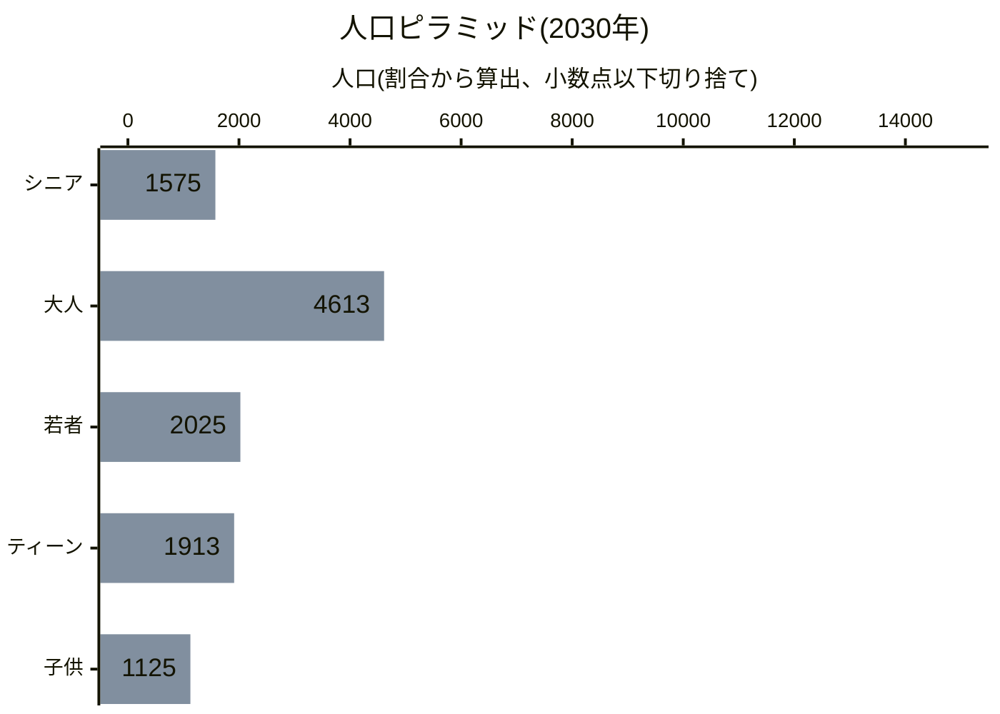
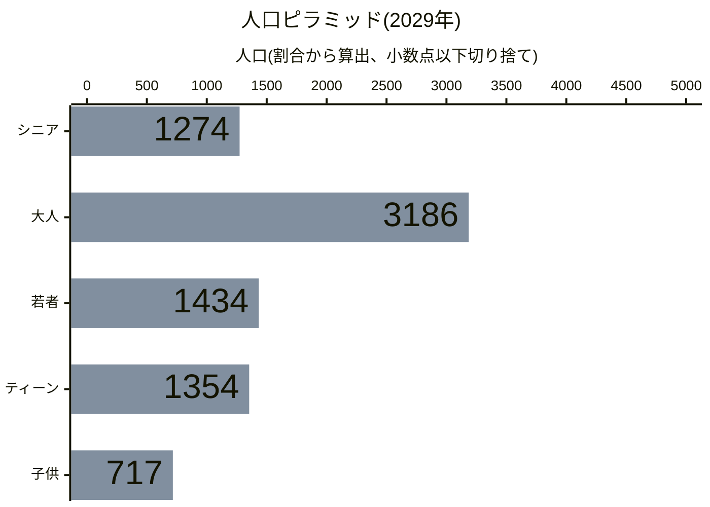
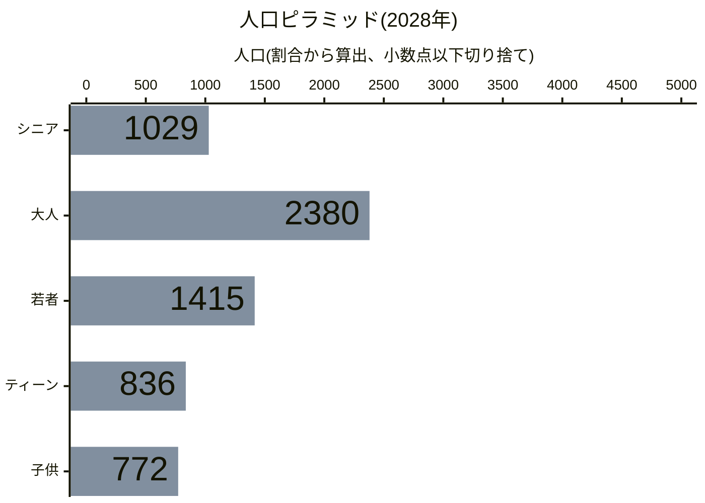
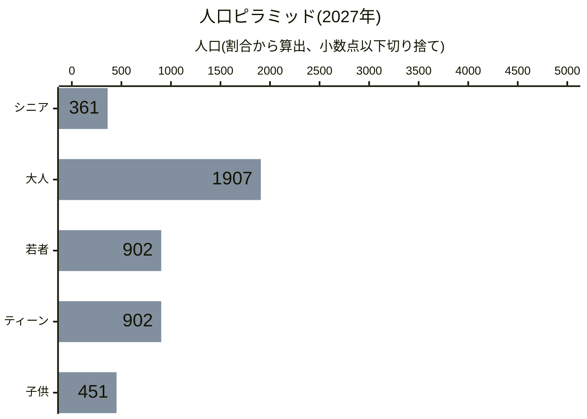
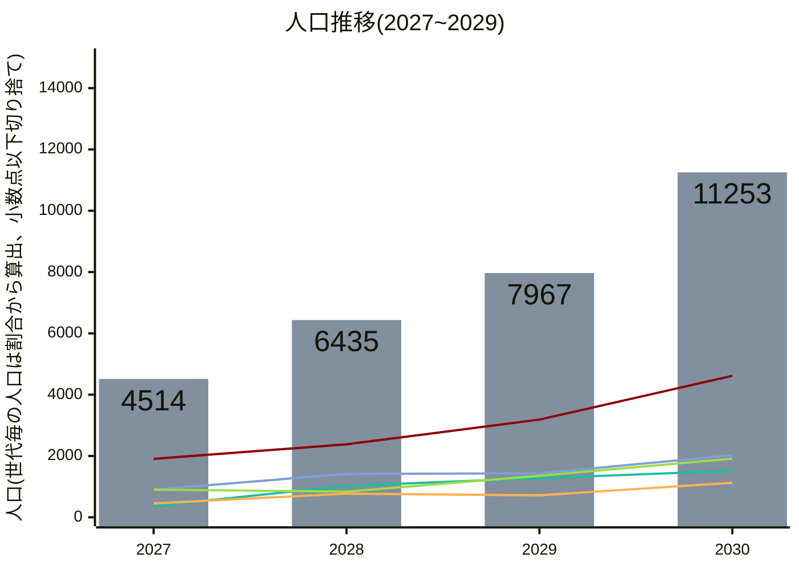
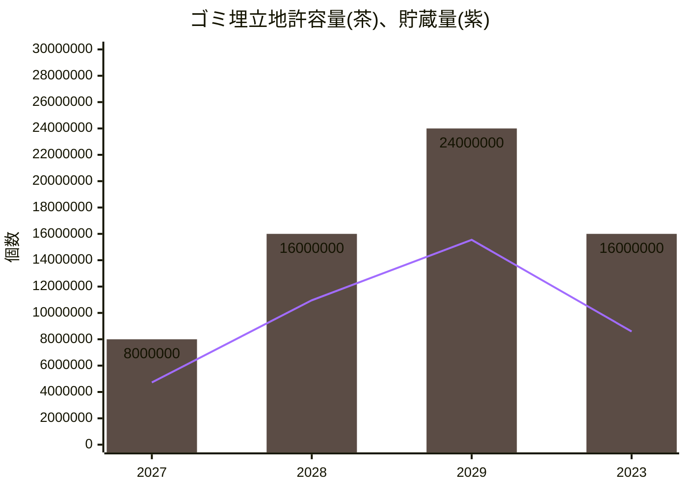
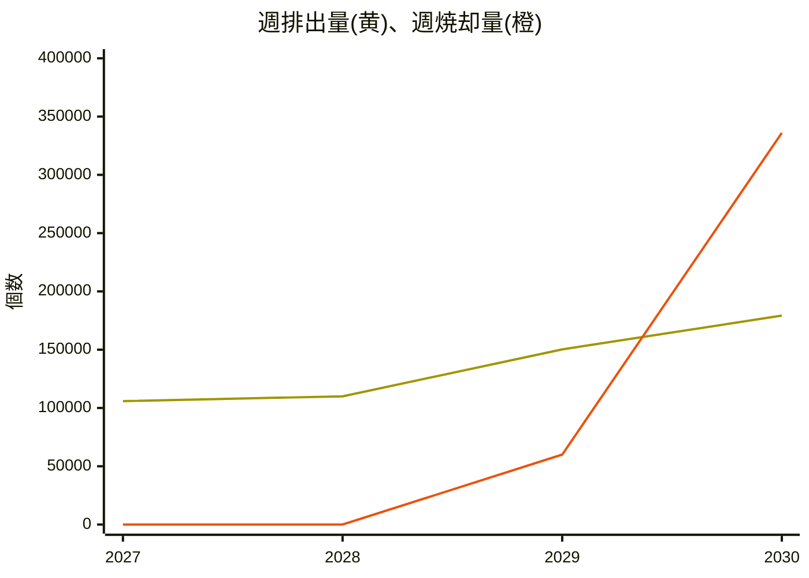

# 澳北市統計データ
## 財政
### 収入の部

|年|住宅区|商業区|工業区|特区|オフィス区画|公共交通機関|通行料|
|:-:|-:|-:|-:|-:|-:|-:|-:|
|2030|25677.20|12754.51|2172.50|1153.79|0|654.00|0|
|2029|14761.60|8620.06|3520.10|N/A|0|226.00|0|

> 週あたりの収入。2029年は「工業区」の値が「特区」を含む。

### 支出の部
|年|電力|上下水道|ゴミ|健康管理|消防|警察|教育|公園と広場|ユニーク施設|バス|地下鉄|鉄道|船|飛行機|
|:-:|-:|-:|-:|-:|-:|-:|-:|-:|-:|-:|-:|-:|-:|-:|
|2030|3170.40|1253.84|10400.00|2260.00|2560.00|960.00|5040.00|112.00|0|779.84|0|0|0|0|
|2029|4130.40|1231.28|2880.00|1660.00|2560.00|960.00|3920.00|72.00|0|549.00|0|0|0|0|
> 週あたりの収入。

### 財政バランス

#### 2030年
[](https://mermaid.live/edit#pako:eNqFU1tv0lAc_yrkPENz2p5eX_XVL2D60o2OkdiWdCVRCYm0Y45tcYuOeYE4J7KgkYuGuIHu05RT6Lfw9EC5LDG-nfO7_C-_nFMC23bWACrIZDKatW1bO_mcqlmplAbcXcM0NKCS45a-R06aRUWa5TqGYeqFzJbh6uQO8OkrXG0HlV7kd2JZKhX7J3enuFfFJ2MNpNQUJ4iSxHAwYXH9IGx3E5blJAExApuw0_NWws4harlpJyCpx0ocI8AVO62NNvQxFn58SxyxnGUFnpGUlTzwvgV-PfBagTfCzcGi6mq86ndc_TEZf4lefAi_XkYXn2NaJENCGK8cnvfxy_H9laPGb3zUiJU8K0EGLctNbo8mt8fhYBhV3tBxODKOjBI68IaBf0kJiCCkPRZzVNp4fDPtXU3PDujanLhOh78Oo3c_KSFsELPuNe7Tisqmof5-5lGDQDqtNyILN18HlQ4e-_jTcJ4ZtyYI_OvAPw78P4HXDy_uZp3ufwNbS9s_IznHBklSlotTX3NAkolq-2vVaJS1_UVWa-DscHRf1mrMrk5IQ4qDNMg5-SxQXadopIFpOKYeX0Hpn0-6TDwF3Xps22Zic-xibheoO_qTPXIrFrK6azzM6zlHN5eoY1hZw3lgFy0XqBxEIq0C1BJ4ClQWKgwviTKSkSIoMi-jNHhGYJ5lEBKQxHGQZaHIoXIaPKeNIXmbSFREjudlCCURCWlgZPOu7Tyaf0_6S8t_AZDhW4s)

昨年以前の財政バランス

#### 2029年
[](https://mermaid.live/edit#pako:eNp1k91u2jAUx18l8jWgOIEQcrvd7gWm3KTFpUhLgtIgbUNIIxldv7RWW-k-QOs6RsWmFdiE1sLWpzEOyVvMNg0NSLuzz___O0fn-LgGNu0iAhpIp9O6tWlbW-WSpluCoAN3G5lIBxo9bhg79KRb3KRbroOQaVTSG8g16B2Q49ek2cONQeT3mU0QGD-7PSaDJjma6kDQBJjNKzCjiLFKWrtB7ypWVUUSM6ISi_PTbiwuQpy47sVBTZBzFIDivTrfn6z4WSz49I4SzJ4wYu879lvY62JvQjqju3wi6yM4HZJX0_U-ovYfctBmpiyUxUx22cLs5mB2cxiMxlHjLZOhJMOMpMYy9sbYP2eCpKq0u_vWGz0yvZ4PLuYnu5xTlKQc_N6L3v_iXG5FCK8uyZAnLKwCrQ-hxwG5IK0Uav4gnTe40SdTn3weM0deSujYv8T-Ifb_Ym8YnN2G_eSsFnjz52z6NXrxMfh2Hp19ST4H9k_oBBmQyxaWSTnXGdG5RPsv1yZPI3eTSgTDvcm6rdsOL45oQR4HKVByykWguU4VpYCJHNNgV1D775bWKVMxrMe2bcaYY1dL20DbMp7s0Fu1UjRc9LBslBzDXEYdZBWR88CuWi7QoArzPAvQauAp0OgDyiqU6NblIVRkKKfAM-qi-1DI5VRFzYpQgqpUT4HnvKyYoStNhQKk05FFyqQAKpZd23m0-G_829X_Af5ZSKc)

 

## 人口
最新のデータを年代別の人口ピラミッドとして描画すると以下の通りです。

<!--グラフを更新したら画像の更新も忘れずに！-->
[グラフをご覧になれない環境の方向け画像リンク](https://mermaid.ink/img/pako:eNplkE1vEzEQhv-KNRxapN1qvd_xgUt6RIITB7o9OImTrLRZR44jkkaRmqygDRFqD6AeekACyscBVAESNCD-jLNtfwbebApIzOl9PTPPjGcEdd5gQMA0zSit87QZt0iUIh2DYbVNhVy7IuqFvydilkoqY54StNHmIt7j2icbf-t6bf5om0p6l9ZYQpAUfVYmZZt12AMqYlpLWO8f8v-ziugmXFZ5wsV9mjApmZ53K8Rhs9LUw1YLR-lguNpqzY9lwlAEy8UiP3qtsucq-6CylyrLVDbbtC3Hyi--3o5g_UGTDuIe2olATb-pbK6mryIwdHv-5p0mlPp6fna9_7jUKnuiphr7U2Vf1pUfj5e_TiPYLYnDknizwGY--5wfH6qJRs-uPp3kBwu1P8nPjy5fnF9NL5Y_zpbf5_nhgZo-vXz2Xk3e6tWQhUzzDsKeZVkltEYF2sFe4BnI9bFjINuytcaVQmNse7tgQEvEDSDFpQ3oMNGhhYVRQYhgdfYIiJYN1qT9RBYnGOu2Lk0fct656RS832oDadKkp12_26CSbce0JWjnz6tgaYOJKu-nEojvOCsIkBEMgGAcbFm-b9kV3wldD7sGDIG44VYYuJUgxI7vBK7tjg3YW021dMIb_wapOOnW?type=png)

昨年以前の人口ピラミッド

<!--グラフを更新したら画像の更新も忘れずに！-->
[グラフをご覧になれない環境の方向け画像リンク](https://mermaid.ink/img/pako:eNplkE1vEzEQhv-KNRxapN1onf3y7oFLekSCEwe6PTiJk6y0WUeOI5JGkZqsoA0Rag8gDhyQgPJxAFWABA2IP-Ns25-BN5sCEnOw5h17nnk9Y2jwJoMQTNOM0gZPW3E7jFKkYziqdaiQG1VEo9B3RMxSSWXM0xBtdbiI97nWydbfd_0Of7BDJb1N6ywJkRQDVl7KDuuye1TEtJ6w_j_k_2cV0Uu4rPGEi7s0YVIyPe8GwaQVtPSwteEoHY7Wrjb8WCYMRbBaLvPj1yp7qrIPKnupskxl8-2qVQ3y8683I9h80KTDuI92I1CzbypbqNmrCAzdnr95pwllfrU4vTp4WOYqe6RmGvtTZV82Lz-erH69iGCvJI5K4rWB7Xz-OT85UlONnl9-ep4fLtXBND87vnh2djk7X_04XX1f5EeHavb44sl7NX2rrSELmeYt5FqWVTLrVKBdXPUdA9mYeAbCjq1zbLv69LG_Bwa0RdyEsNizAV0murSQMC4AEayXHkGo0yZr0UEiiwVMdFuPpvc57153Cj5odyBs0aSv1aDXpJLtxLQtaPdPVbC0yUSND1IJoefjNQTCMQwhxJ5fIb7rOy6xLcsLAgNGuuraFc9xiOOTwCG-400M2F9PtSoecbHluA4JbIyrmEx-AwU07D4?type=png)

<!--グラフを更新したら画像の更新も忘れずに！-->
[グラフをご覧になれない環境の方向け画像リンク](https://mermaid.ink/img/pako:eNplkM9u00AQxl9lNRxaJDvatZ3Y2QOX9IgEJw7UPWySTWLJ8UabjUgaRWpiQRsi1B5AHDggAeXPAVQBEjQgXmbjto_BOk4BiTnNtzvz-2ZmDA3R5EDBtu0waYikFbVpmCATw1Gtw6TaqDwaub4jI54opiKRULTVETLaF0bHW3_r-h3xYIcpdpvVeUyRkgNefKoO7_J7TEasHvP-P-T_vfLoxULVRCzkXRZzpbjxuxGQoFVtGbP1wGEyHK2n2vAjFXMUwmq5zI5f6_SpTj_o9KVOU53Otx3sBNn515shbBa02TDqo90Q9OybThd69ioEy7Rnb94ZQpFfLU6vDh4WuU4f6ZnB_tTpl03lx5PVrxch7BXEUUG8HmA7m3_OTo701KDnl5-eZ4dLfTDNzo4vnp1dzs5XP05X3xfZ0aGePb548l5P35rREEa2fQuVMcYFs84k2iXYqVrIcQNsIeKRsoUCt2Ih33f2wIK2jJpA8zNb0OWyy3IJ47w_hPXNQ6AmbfIWG8Qq339i2nosuS9E97pTikG7A7TF4r5Rg16TKb4TsbZk3T-vkidNLmtikCigPl4zgI5hCNTDbgn72CuXMan4rhdYMAJKXFKqkAA7xPNIJcCeP7Fgf-2KS76HHexXfUw8x6145clvHt_rww?type=png)

<!--グラフを更新したら画像の更新も忘れずに！-->
[グラフをご覧になれない環境の方向け画像リンク](https://mermaid.ink/img/pako:eNplkM9v0zAUx_8V63HYkJLKTtOk9YFLd0SCEweWHdzGbSOlceW6ol1VaW0EW6nQdgBx4IAEjB8H0ARIsIL4Z9xs-zNwmg6QeAfrfe33_bznN4amCDlQsG07SJoiaUVtGiTIxHBU7zCpNiqPZq7vyIgniqlIJBRtdYSM9oXR8dbfun5HPNhhit1mDR5TpOSAF4-qw7v8HpMRa8S8_w_5_1559GKh6iIW8i6LuVLc9LtRJdVWrWWarQcOkuFoPdWGH6mYowBWy2V2_FqnT3X6QacvdZrqdL7tYMfPzr_eDGDzQZsNoz7aDUDPvul0oWevArCMPXvzzhCK_GpxenXwsMh1-kjPDPanTr9sKj-erH69CGCvII4K4vUA29n8c3ZypKcGPb_89Dw7XOqDaXZ2fPHs7HJ2vvpxuvq-yI4O9ezxxZP3evrWjIYwsu1bqIIxLpgNJtFu2SMWIjXsW6iGnc3hVsgeWNCWUQg0X7IFXS67LJcwzt0BrDceADVpyFtsEKv89xNj67HkvhDda6cUg3YHaIvFfaMGvZApvhOxtmTdP7eSJyGXdTFIFFDPWzOAjmEI1MXlEvaxW6lg4vllt2rBCCgpk5JHqtghrku8Knb9iQX766645LvYwX7Nx8R1yp5bmfwGa6jrXQ?type=png)

 

また、統計開始時からの人口の推移は以下の通りです。

> **凡例**  
> 青緑: シニア  
> 赤: 大人  
> 青紫: 若者  
> 黄緑: ティーン  
> 黃: 子供  

<!--グラフを更新したら画像の更新も忘れずに！-->
[グラフをご覧になれない環境の方向け画像リンク](https://mermaid.ink/img/pako:eNplUrtu2zAU_RWCGZICkiFKlEhq6OKMHTp1qJWBtihbgCwZsozaNVzUXpI0aNKl7QcEbTMlQafU_hz58Ru9tOwgQe5AHN7HuedQGuNWFirsY9M0g7SVpVHc9oMUQQxH9Y7Mi91NR7-TfTiWhXwjmyrxUZEPVFUsOqqr3sk8ls1E9Z9MvOTQ0Uuyop4lWf5WJqoolI8ODzjhkYgMdEBaTSUUAB5aEBoQoUIXgGiFIWUAoqhpu85hkG5VB-lw1NJrdmLiIlEowMv5fHV1vb682fxZHNmWzT7BIV4FeGfPlMO4jxoB1rUAG2iL-CMSe-RYAT6phkbV0J78aPnwY7m4Xt9dltPbKlVO71bnf1ffzsrpRTk739z-XJ3Oy8_T1f3V-vv9ZvZvufi1fLhYnZ2Wsy_rrzfl9DdIQhYyzdeIuOC42tSUOWpQl1ADedQB90x4YJ0QML4Tk8SpajgegSyohQ6iG1zCntaJsCBrOxxekjgu0FGPPGMQlg0lSlx9OtAA3t0XDdzxDOQQDicRzwlAJSxnmsVmtNJ4gg3czuMQ-_ovMXBX5V2pr3isJwO8_WUC7AMMVSQHSaE_zATGejJ9n2Xd_WSeDdod7Ecy6cNt0AtloY5j2c5l9zGbqzRUeT0bpAX2PepuSbA_xkPsC14TDvgnVNgWdSxu4BH2QWIN3oQQwaFme4xNDPxxu9aqMcEZo5DjxGKUOpP_Gif-Gw?type=png)

## 廃棄物処理
統計開始時からのゴミ埋立地の許容量、貯蔵量の推移は以下の通りです。

<!--グラフを更新したら画像の更新も忘れずに！-->
[グラフをご覧になれない環境の方向け画像リンク](https://mermaid.ink/img/pako:eNplUU2P0zAU_CvW28OyUlI5X07sA5fukQMnDtR7cBOnjZTGleuIlqrSAgcOReLC3pD2irQSLGhB4vdUZcu_IE6yFYI5zZvnmednryFVmQQGruvyKlVVXkwYr1CD5Wo4Fdr0lcViql6cCyOeiLEsGTK6ll3TTOVMPhO6EONSLv5y_J9hMS-VGapS6aeilMZIhk5PonGYhpGDToRP0jy3xKME44bINPJwesqr9o68Wq5SG9qPLkwpEYfd67vdm-v99fb-Zrv_eHv49HX_-efvt-8fHd79ONtdvjp8-3L48N0K93c3Zxz6HV2xLBZoxMHHfszBQS1LjoweWcDhojOtOhOH_eX219UtB4SR6z5GAe7QnRoLjUZJpzjIIw_MD__V-tiyqOQojP2-iSnpWRSFpH2JJKLWfAEOTHSRAbM_4MBM6pmwJaxtEof2OziwhmYyF3Vp7L6bxjYX1XOlZg9OrerJFFguykVT1fNMGHleiIkWs6OqZZVJPVR1ZYCRkLYhwNawBEaTAQ38IPFC6uMwwIkDK2CeHw2CBHseTZqeT-J448DLdiwexDSJ45BElAQBCUi0-QPvqcQk?type=png)

また、統計開始時からの週あたりのゴミ排出量、焼却量の推移は以下の通りです。

<!--グラフを更新したら画像の更新も忘れずに！-->
[グラフをご覧になれない環境の方向け画像リンク](https://mermaid.ink/img/pako:eNplUE1rGzEQ_StickgDu0baT0mHXpxjDj310MgHZVe2F3ZXRtYSu8bgQiCH0hYKOfQn9NZCTmn_TbGL_0WktRMCeQj05s28GY1WUOhSAYcwDEVb6HZcTbhokcNiOZxKY4-Rx3yqr8-llRfyStUcWdOpQ9JOVaPeS1PJq1rNXzhe9_CY1doOda3NO1kraxVHpyeSsAzjAJ2oIiW4OBVt_yLRLpaFb3EcVNlaIQH7ze_d1-_b24f97bc3-z83Z_82n5z2_-bv9su913Y_f5wJOC4SykU1R5cCIhzlAgLUM_rM2BOLsYDRwbQ8mARsN593d78EIIzC8C1KsMehpq5adUlwSikNEMGM0cTdKY4StwjJWZQloxeVTnQn8_4AxbEnIwhgYqoSuP_MABplGulDWHmjgP5nBXBHSzWWXW39Vmtnm8n2g9bNk9PobjIFPpb13EXdrJRWnVdyYmTzrBrVlsoMddda4FlG-ibAV7AAzuiAxVFMScIinMSYBrAETqJ0EFNMCKMuF2V5vg7gYz8WD3JG8zzJUpa5ZeIsXT8C2Ru0OA?type=png)