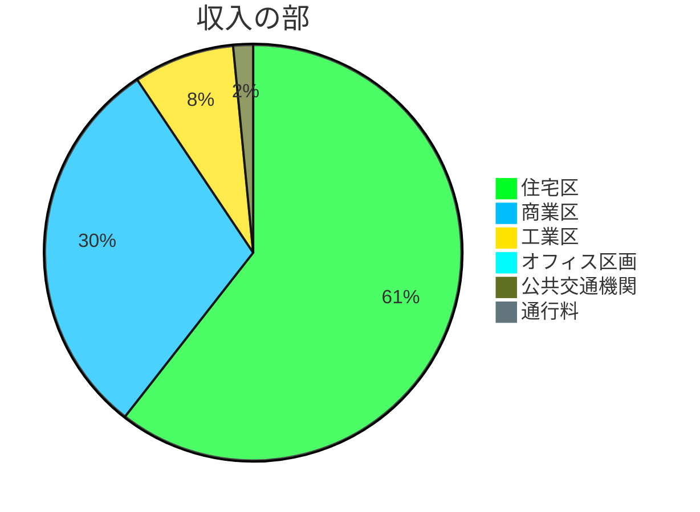
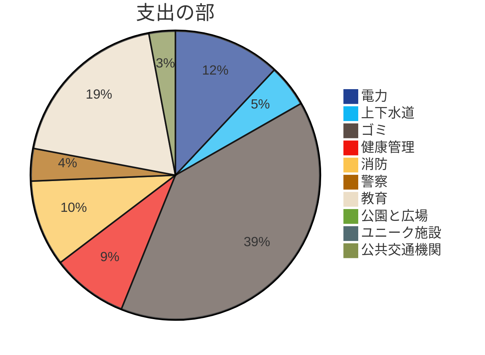
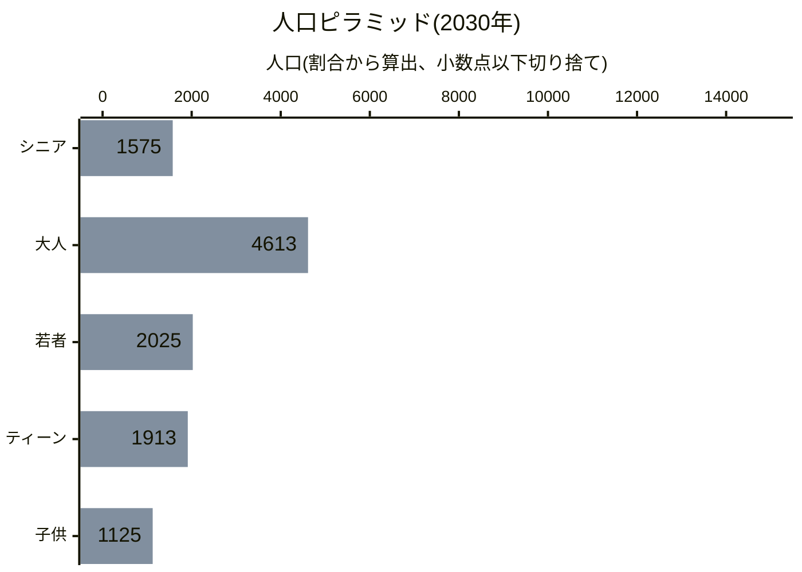
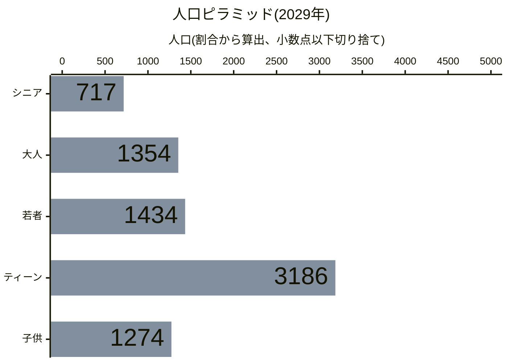
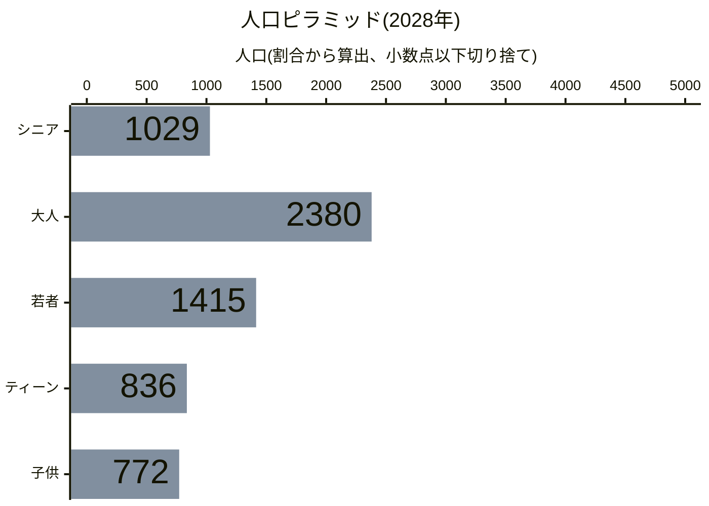
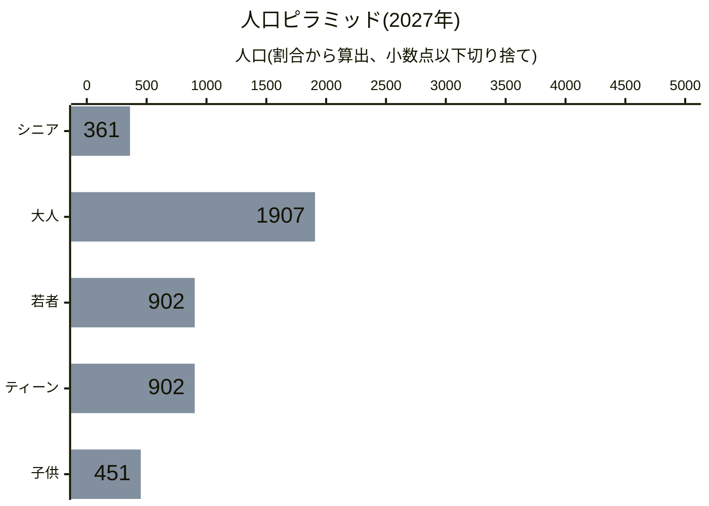
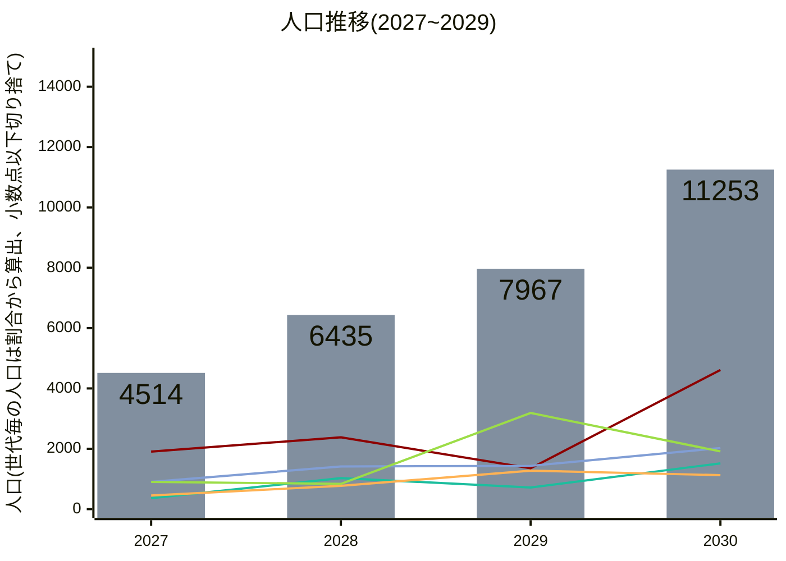
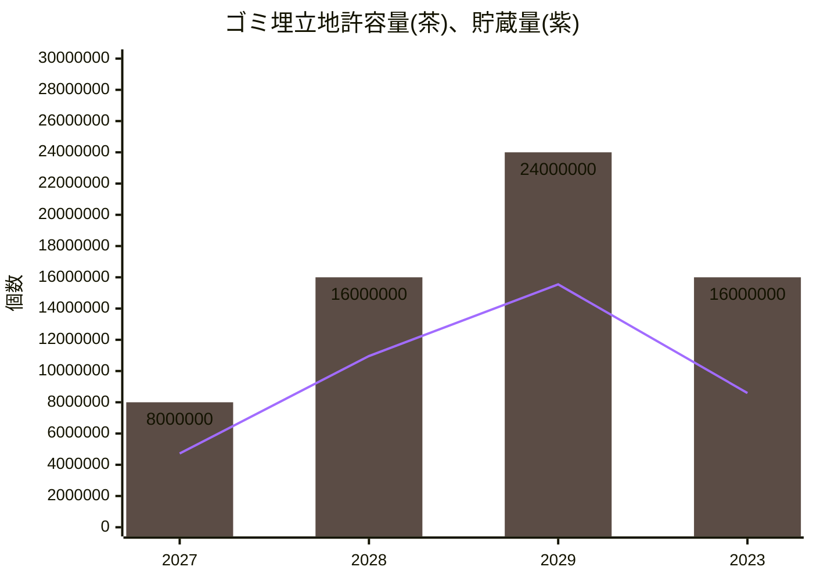
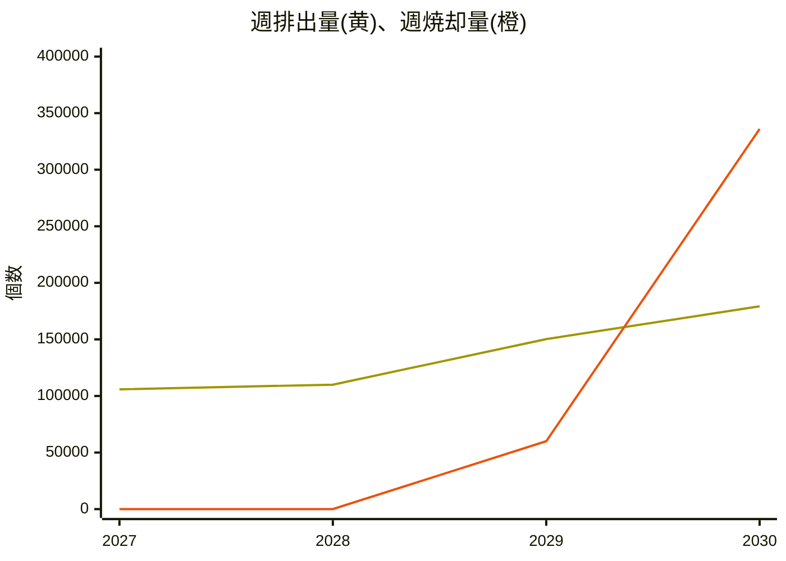

# 澳北市統計データ
## 財政
<!-- ### 収入の部

住宅区 14761.60
商業区 8620.06
工業区 3520.10
オフィス区画 0
公共交通機関 226.00
通行料 0

-->

<!-- ### 支出の部

電力 4130.40
上下水道 1231.28
ゴミ 2880.00
健康管理 1660.00
消防 2560.00
警察 960.00
教育 3920.00
公園と広場 72.00
ユニーク施設 0
バス 549.00
地下鉄 0
鉄道 0
船 0
飛行機 0

-->
<h3>2030年</h3>

|収入の部|支出の部|
|:-:|:-:|
|[](https://mermaid.live/edit#pako:eNpNkEGL00AYhv_K8EnJJYTJZDLTnav-Bg-Sy3TzpRtokpImoIaAdqmnxb24C3oRXQsquwuexBV_TTbV_gunaVKd08zzvO_3wVRwnIUICkajKk7jQpHKKk4wQUsRa6IXaNlkDx7rPNaTGS6MqYg1j9HdZR5QGiHzdzGDWI8mGGGPvA5FiIzSHvF9ikWTKOyR3yHBJGW8R2JAvjy26roejYI0SI0gRVzMkLTnr9vVunl5uz39HKTEnADuf523t6v27C4AogjzhZQOo4NtL15t1jeDdc1k7vjuwX5f_2c9jwmHy0E2y6_N6UWzvGqWP0zk95ufXerf6NV1u_p2f_dp--Ld5sv77eXHzguzgR5Cxv35cLa5fLvvgg3TPA5BFXmJNiSYJ3r3hGpXCKD79gCUuYYY6XJWBBCktanNdfoky5KhmWfl9ARUpGcL8yrnoS7wUaynuU4ONMc0xPxhVqYFKMH8bgioCp6Ccl3pUCEoOxLemPsut-EZKD52xpIfybHrCU9yxmsbnndbqRF-_Rf5TL8d) 42412.18/週|[](https://mermaid.live/edit#pako:eNpVkt2K00AYhm8ljJSclDIzmUx-TvUaPJCcTJNpN9CkJU1BDQHbsCq7J-LP4rrCquhSwd2qFF2qXk2abnMXTifp0uYo8zzv-31JSALcvseBDRqNxA_92FYSNT7gAVdtRW2zIVebSgXus8hn7R4fCpMo6sDnaJO5gyGBFtnEBMISIdg2OnqNNIn0NnHJFhGJOhDp0KuRXiHXJYTXiErEPKpBXCNDIu563DVqZEpEXaZptEZWtRFT19gWEZTMJBYirpqmaaPhhE4ojBL7cY8rq9ez4tkiH1-V2dQJFXE5oDz7UxydOUCxFQ0ZsEXg1iyvj5bXx6vv83L8SnqEda1lkq3PJ_M8O6-M-DywBW-rxfhLsfh9c_Xx5sVTGcCY7vrVr-fl25-V0ffM-vKimFVDrf3Km9P1pKroYtvussNvxfuX-XhaLLLiw7x6IIR3Enl2kWfHefY3n8xWJ__W00sZ2ptw-GO5-Fw-ebf6el6efJLeMCzxuqAJupHvATuORrwJAh4FbHMEyabuAPnfOMAWtx7vsFEvdoATpqI2YOGDfj_YNqP-qHsA7A7rDcVpNPBYzO_5rBux4JZGPPR4dLc_CmNgU2zJIcBOwENgI2S0IKUQW1QziY5IEzwCNjFbpkEsw0Qa1QyCSdoEj-VWKISe_gc0jvmU) 28,079.52/週|

昨年以前の財政状況

<h3>2029年</h3>

|収入の部|支出の部|
|:-:|:-:|
|[](https://mermaid.live/edit#pako:eNpNkEFr2zAYhv-K-EbwxQRJtmVX1-437DB0UerPqSG2g2PDNmPYUrJTWS9rYbuMrQuspS3sNNbRX-M6W_7FFMfJppP0PO_7Cb4KjrIQQcJgUMVpXEhSWcUxJmhJYo30DC2bbMEzncd6NMGZMRWxpjGyTeYJpRFybxMziPdohBH2yOlQhMgp7ZG7TfFoFIU98jokuE-52yOxQ55_ZNV1PRioVKVGkCIuJkjas3ftYtm8uVuffFMpMUfB48NZe7doT-8VEEmY6ws2FHRn2_O3q-XtzgaC0yEVe_lj-Z90PCPZvtnMr5uT82Z-2cx_msjv97-61L_Ji5t28f3x_uv69cfV1af1xZfOcy6G-4xRfz6fri4-bKtgwziPQ5BFXqINCeaJ3jyh2hQUdEtXIM01xEiXk0KBSmtTm-r0eZYlu2aeleNjkJGezMyrnIa6wKexHuc62dMc0xDzw6xMC5CC-d0QkBW8AMmYb9YgKD8QTuB6zLXhJUg3GAa-e-AHzBGO73K3tuFV9ys1wqv_AqzgvqQ) 27127.76/週|[](https://mermaid.live/edit#pako:eNpVkt2K00AYhm8lfFJyUsrMZPI3p3oNHkhOpsl0N9CmJU1BDQHbsCq7J-LP4rrCquhSwd2qFF2qXk2abnMXppN02c7RzPO87_dBSAxu3xPAoNGI_cCPmBKr0b7oCZUpapsPhdpUKnCfhz5vd8WwNLGiDnyBN5k7BFFk002sREQijNpmR6-RJpHepi7dIipRB2EdeTXSK-S6lIoaGRJxz9AQqZEpkXA94Zo1siQyXK5pRo3saiMxXHNbxEgyi9qYumqSJI2GEzhBaZTIj7pCWb2e5c8W2fiySKdOoJTHgeL0T3546oDCFEo01KJoa5ZXh8uro9X3eTF-JT0mGm4Ra-uzyTxLz6QhloVa6KaZj7_ki9_Xlx-vXzytmoZx269-PS_e_qya-o5ZX5zns2qmvVt5c7KeVBXNJjvLDr7l719m42m-SPMPcxkxya1Alp5n6VGW_s0ms9Xxv_X0QmZ2Bhz8WC4-F0_erb6eFcefpNepDU3YC30PWBSORBN6IuzxzRPiTdcB-cs4wMqrJzp81I0ccIKkrA148KDf722bYX-0tw-sw7vD8jUaeDwS93y-F_LeDQ1F4Inwbn8URMAMguUQYDE8BIax2ULlNyS2oVlUx7QJj4BRq2WZ1DYtrBmaSQlNmvBYbkWl0JP_DY_4nw) 19,103.28/週|

 

## 人口
最新のデータを年代別の人口ピラミッドとして描画すると以下の通りです。

<!--グラフを更新したら画像の更新も忘れずに！-->
[グラフをご覧になれない環境の方向け画像リンク](https://mermaid.ink/img/pako:eNplkE1vEzEQhv-KNRxapN1qvd_xgUt6RIITB7o9OImTrLRZR44jkkaRmqygDRFqD6AeekACyscBVAESNCD-jLNtfwbebApIzOl9PTPPjGcEdd5gQMA0zSit87QZt0iUIh2DYbVNhVy7IuqFvydilkoqY54StNHmIt7j2icbf-t6bf5om0p6l9ZYQpAUfVYmZZt12AMqYlpLWO8f8v-ziugmXFZ5wsV9mjApmZ53K8Rhs9LUw1YLR-lguNpqzY9lwlAEy8UiP3qtsucq-6CylyrLVDbbtC3Hyi--3o5g_UGTDuIe2olATb-pbK6mryIwdHv-5p0mlPp6fna9_7jUKnuiphr7U2Vf1pUfj5e_TiPYLYnDknizwGY--5wfH6qJRs-uPp3kBwu1P8nPjy5fnF9NL5Y_zpbf5_nhgZo-vXz2Xk3e6tWQhUzzDsKeZVkltEYF2sFe4BnI9bFjINuytcaVQmNse7tgQEvEDSDFpQ3oMNGhhYVRQYhgdfYIiJYN1qT9RBYnGOu2Lk0fct656RS832oDadKkp12_26CSbce0JWjnz6tgaYOJKu-nEojvOCsIkBEMgGAcbFm-b9kV3wldD7sGDIG44VYYuJUgxI7vBK7tjg3YW021dMIb_wapOOnW?type=png)

昨年以前の人口ピラミッド

<!--グラフを更新したら画像の更新も忘れずに！-->
[グラフをご覧になれない環境の方向け画像リンク](https://mermaid.ink/img/pako:eNplkM9v0zAUx_-V6HHYkJLKTtwm9YFLd0SCEweWHdzWbSOlceW6ol1VaW0EW6nQdgBx4IAEjB8H0ARIsIL4Z9xs-zNwmg6QeIen97X9Pu_rN4aGaHKg4DhOmDRE0oraNEwsE8NRrcOk2qg8Grm-IyOeKKYikVBrqyNktC-Mjrf-vut3xIMdpthtVucxtZQc8OJSdXiX32MyYvWY9_8h_z8rj14sVE3EQt5lMVeKm3k3Ahy0qi0zbG04TIajtasNP1Ixt0JYLZfZ8WudPtXpB52-1Gmq0_m2i9xqdv71ZgibDzpsGPWt3RD07JtOF3r2KgTbtGdv3hlCUV8tTq8OHha1Th_pmcH-1OmXzcuPJ6tfL0LYK4ijgnhtYDubf85OjvTUoOeXn55nh0t9MM3Oji-enV3Ozlc_TlffF9nRoZ49vnjyXk_fGmsWshznllVGCBXMOpPWro9928JemZhMPJM9HFRM7fpkD2xoy6gJNN-zDV0uuyyXMM4BIayXHgI1ZZO32CBW-QImpq3HkvtCdK87pRi0O0BbLO4bNeg1meI7EWtL1v1zKnnS5LImBokC6pM1A-gYhkAJ8krIR6RcRrjieySwYQQUe7hUwQFyMSG4EiDiT2zYX09FJZ8gF_lVH2HiehVSnvwG-iHr-w?type=png)

<!--グラフを更新したら画像の更新も忘れずに！-->
[グラフをご覧になれない環境の方向け画像リンク](https://mermaid.ink/img/pako:eNplkM9u00AQxl9lNRxaJDvatZ3Y2QOX9IgEJw7UPWySTWLJ8UabjUgaRWpiQRsi1B5AHDggAeXPAVQBEjQgXmbjto_BOk4BiTnNtzvz-2ZmDA3R5EDBtu0waYikFbVpmCATw1Gtw6TaqDwaub4jI54opiKRULTVETLaF0bHW3_r-h3xYIcpdpvVeUyRkgNefKoO7_J7TEasHvP-P-T_vfLoxULVRCzkXRZzpbjxuxGQoFVtGbP1wGEyHK2n2vAjFXMUwmq5zI5f6_SpTj_o9KVOU53Otx3sBNn515shbBa02TDqo90Q9OybThd69ioEy7Rnb94ZQpFfLU6vDh4WuU4f6ZnB_tTpl03lx5PVrxch7BXEUUG8HmA7m3_OTo701KDnl5-eZ4dLfTDNzo4vnp1dzs5XP05X3xfZ0aGePb548l5P35rREEa2fQuVMcYFs84k2iXYqVrIcQNsIeKRsoUCt2Ih33f2wIK2jJpA8zNb0OWyy3IJ47w_hPXNQ6AmbfIWG8Qq339i2nosuS9E97pTikG7A7TF4r5Rg16TKb4TsbZk3T-vkidNLmtikCigPl4zgI5hCNTDbgn72CuXMan4rhdYMAJKXFKqkAA7xPNIJcCeP7Fgf-2KS76HHexXfUw8x6145clvHt_rww?type=png)

<!--グラフを更新したら画像の更新も忘れずに！-->
[グラフをご覧になれない環境の方向け画像リンク](https://mermaid.ink/img/pako:eNplkM9v0zAUx_8V63HYkJLKTtOk9YFLd0SCEweWHdzGbSOlceW6ol1VaW0EW6nQdgBx4IAEjB8H0ARIsIL4Z9xs-zNwmg6QeAfrfe33_bznN4amCDlQsG07SJoiaUVtGiTIxHBU7zCpNiqPZq7vyIgniqlIJBRtdYSM9oXR8dbfun5HPNhhit1mDR5TpOSAF4-qw7v8HpMRa8S8_w_5_1559GKh6iIW8i6LuVLc9LtRJdVWrWWarQcOkuFoPdWGH6mYowBWy2V2_FqnT3X6QacvdZrqdL7tYMfPzr_eDGDzQZsNoz7aDUDPvul0oWevArCMPXvzzhCK_GpxenXwsMh1-kjPDPanTr9sKj-erH69CGCvII4K4vUA29n8c3ZypKcGPb_89Dw7XOqDaXZ2fPHs7HJ2vvpxuvq-yI4O9ezxxZP3evrWjIYwsu1bqIIxLpgNJtFu2SMWIjXsW6iGnc3hVsgeWNCWUQg0X7IFXS67LJcwzt0BrDceADVpyFtsEKv89xNj67HkvhDda6cUg3YHaIvFfaMGvZApvhOxtmTdP7eSJyGXdTFIFFDPWzOAjmEI1MXlEvaxW6lg4vllt2rBCCgpk5JHqtghrku8Knb9iQX766645LvYwX7Nx8R1yp5bmfwGa6jrXQ?type=png)

 

また、統計開始時からの人口の推移は以下の通りです。

> **凡例**  
> 青緑: シニア  
> 赤: 大人  
> 青紫: 若者  
> 黄緑: ティーン  
> 黃: 子供  

<!--グラフを更新したら画像の更新も忘れずに！-->
[グラフをご覧になれない環境の方向け画像リンク](https://mermaid.ink/img/pako:eNplUrtu2zAU_RWCGZICkiFKlEhq6OKMHTp1qJWBtihbgCwZsozaNVzUXpI0aNKl7QcEbTMlQafU_hz58Ru9tOwgQe5AHN7HuedQGuNWFirsY9M0g7SVpVHc9oMUQQxH9Y7Mi91NR7-TfTiWhXwjmyrxUZEPVFUsOqqr3sk8ls1E9Z9MvOTQ0Uuyop4lWf5WJqoolI8ODzjhkYgMdEBaTSUUAB5aEBoQoUIXgGiFIWUAoqhpu85hkG5VB-lw1NJrdmLiIlEowMv5fHV1vb682fxZHNmWzT7BIV4FeGfPlMO4jxoB1rUAG2iL-CMSe-RYAT6phkbV0J78aPnwY7m4Xt9dltPbKlVO71bnf1ffzsrpRTk739z-XJ3Oy8_T1f3V-vv9ZvZvufi1fLhYnZ2Wsy_rrzfl9DdIQhYyzdeIuOC42tSUOWpQl1ADedQB90x4YJ0QML4Tk8SpajgegSyohQ6iG1zCntaJsCBrOxxekjgu0FGPPGMQlg0lSlx9OtAA3t0XDdzxDOQQDicRzwlAJSxnmsVmtNJ4gg3czuMQ-_ovMXBX5V2pr3isJwO8_WUC7AMMVSQHSaE_zATGejJ9n2Xd_WSeDdod7Ecy6cNt0AtloY5j2c5l9zGbqzRUeT0bpAX2PepuSbA_xkPsC14TDvgnVNgWdSxu4BH2QWIN3oQQwaFme4xNDPxxu9aqMcEZo5DjxGKUOpP_Gif-Gw?type=png)

## 廃棄物処理
統計開始時からのゴミ埋立地の許容量、貯蔵量の推移は以下の通りです。

<!--グラフを更新したら画像の更新も忘れずに！-->
[グラフをご覧になれない環境の方向け画像リンク](https://mermaid.ink/img/pako:eNplUU2P0zAU_CvW28OyUlI5X07sA5fukQMnDtR7cBOnjZTGleuIlqrSAgcOReLC3pD2irQSLGhB4vdUZcu_IE6yFYI5zZvnmednryFVmQQGruvyKlVVXkwYr1CD5Wo4Fdr0lcViql6cCyOeiLEsGTK6ll3TTOVMPhO6EONSLv5y_J9hMS-VGapS6aeilMZIhk5PonGYhpGDToRP0jy3xKME44bINPJwesqr9o68Wq5SG9qPLkwpEYfd67vdm-v99fb-Zrv_eHv49HX_-efvt-8fHd79ONtdvjp8-3L48N0K93c3Zxz6HV2xLBZoxMHHfszBQS1LjoweWcDhojOtOhOH_eX219UtB4SR6z5GAe7QnRoLjUZJpzjIIw_MD__V-tiyqOQojP2-iSnpWRSFpH2JJKLWfAEOTHSRAbM_4MBM6pmwJaxtEof2OziwhmYyF3Vp7L6bxjYX1XOlZg9OrerJFFguykVT1fNMGHleiIkWs6OqZZVJPVR1ZYCRkLYhwNawBEaTAQ38IPFC6uMwwIkDK2CeHw2CBHseTZqeT-J448DLdiwexDSJ45BElAQBCUi0-QPvqcQk?type=png)

また、統計開始時からの週あたりのゴミ排出量、焼却量の推移は以下の通りです。

<!--グラフを更新したら画像の更新も忘れずに！-->
[グラフをご覧になれない環境の方向け画像リンク](https://mermaid.ink/img/pako:eNplUE1rGzEQ_StickgDu0baT0mHXpxjDj310MgHZVe2F3ZXRtYSu8bgQiCH0hYKOfQn9NZCTmn_TbGL_0WktRMCeQj05s28GY1WUOhSAYcwDEVb6HZcTbhokcNiOZxKY4-Rx3yqr8-llRfyStUcWdOpQ9JOVaPeS1PJq1rNXzhe9_CY1doOda3NO1kraxVHpyeSsAzjAJ2oIiW4OBVt_yLRLpaFb3EcVNlaIQH7ze_d1-_b24f97bc3-z83Z_82n5z2_-bv9su913Y_f5wJOC4SykU1R5cCIhzlAgLUM_rM2BOLsYDRwbQ8mARsN593d78EIIzC8C1KsMehpq5adUlwSikNEMGM0cTdKY4StwjJWZQloxeVTnQn8_4AxbEnIwhgYqoSuP_MABplGulDWHmjgP5nBXBHSzWWXW39Vmtnm8n2g9bNk9PobjIFPpb13EXdrJRWnVdyYmTzrBrVlsoMddda4FlG-ibAV7AAzuiAxVFMScIinMSYBrAETqJ0EFNMCKMuF2V5vg7gYz8WD3JG8zzJUpa5ZeIsXT8C2Ru0OA?type=png)