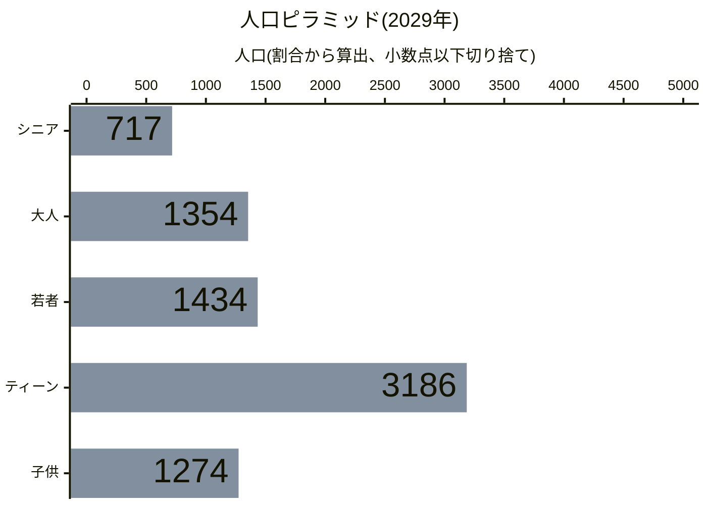
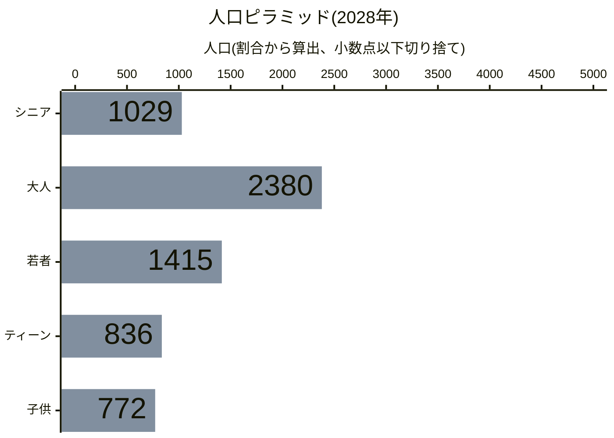
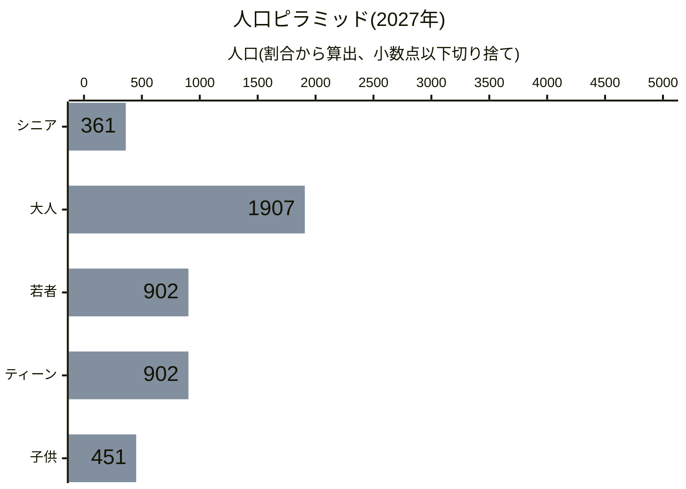
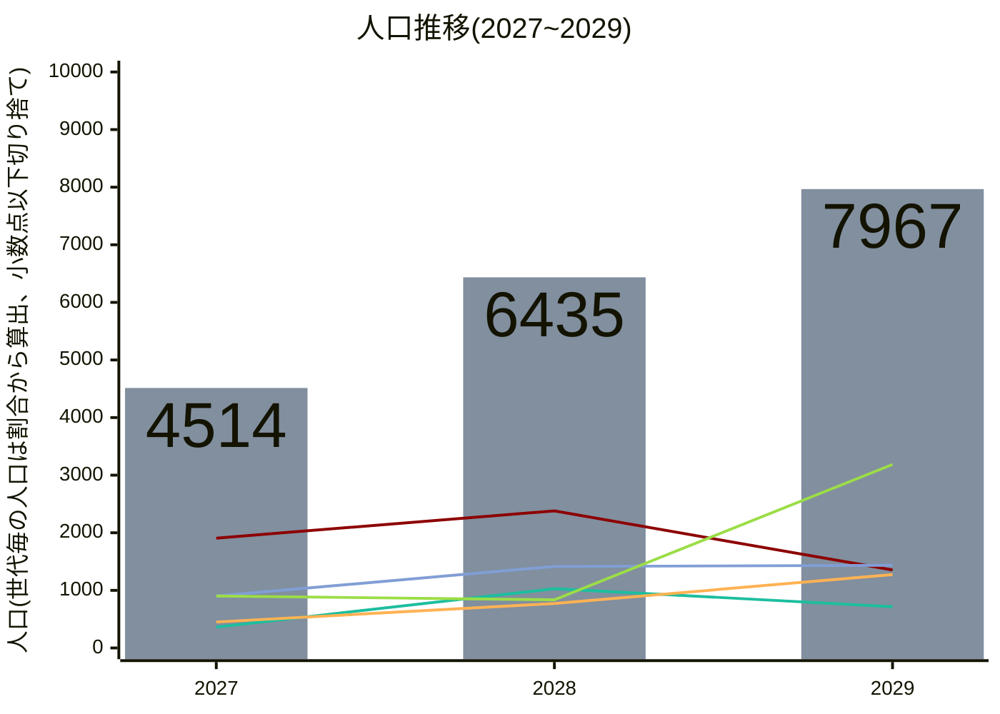
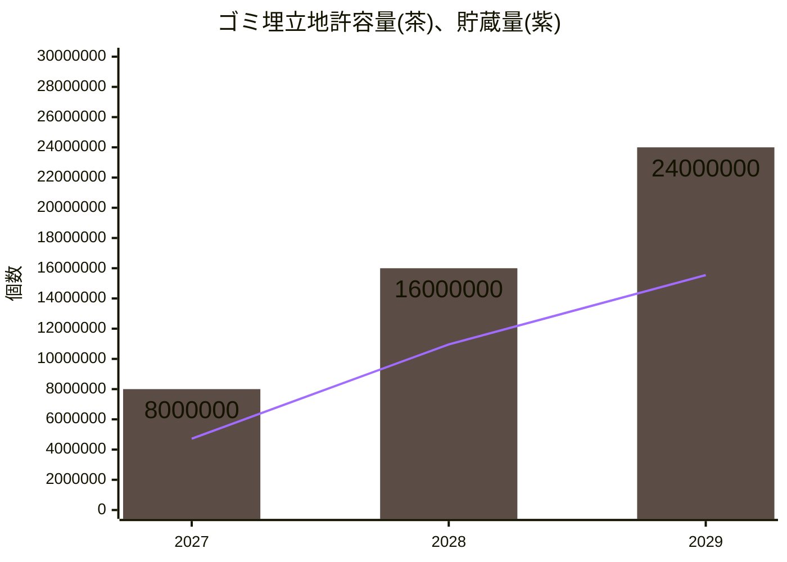
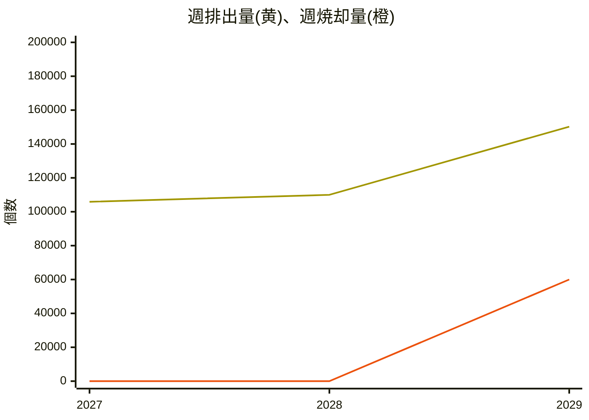

# 澳北市統計データ
## 人口
最新のデータを年代別の人口ピラミッドとして描画すると以下の通りです。

<!--グラフを更新したら画像の更新も忘れずに！-->
[グラフをご覧になれない環境の方向け画像リンク](https://mermaid.ink/img/pako:eNplkM9v0zAUx_-V6HHYkJLKTtwm9YFLd0SCEweWHdzWbSOlceW6ol1VaW0EW6nQdgBx4IAEjB8H0ARIsIL4Z9xs-zNwmg6QeIen97X9Pu_rN4aGaHKg4DhOmDRE0oraNEwsE8NRrcOk2qg8Grm-IyOeKKYikVBrqyNktC-Mjrf-vut3xIMdpthtVucxtZQc8OJSdXiX32MyYvWY9_8h_z8rj14sVE3EQt5lMVeKm3k3Ahy0qi0zbG04TIajtasNP1Ixt0JYLZfZ8WudPtXpB52-1Gmq0_m2i9xqdv71ZgibDzpsGPWt3RD07JtOF3r2KgTbtGdv3hlCUV8tTq8OHha1Th_pmcH-1OmXzcuPJ6tfL0LYK4ijgnhtYDubf85OjvTUoOeXn55nh0t9MM3Oji-enV3Ozlc_TlffF9nRoZ49vnjyXk_fGmsWshznllVGCBXMOpPWro9928JemZhMPJM9HFRM7fpkD2xoy6gJNN-zDV0uuyyXMM4BIayXHgI1ZZO32CBW-QImpq3HkvtCdK87pRi0O0BbLO4bNeg1meI7EWtL1v1zKnnS5LImBokC6pM1A-gYhkAJ8krIR6RcRrjieySwYQQUe7hUwQFyMSG4EiDiT2zYX09FJZ8gF_lVH2HiehVSnvwG-iHr-w?type=png)

昨年以前の人口ピラミッド

<!--グラフを更新したら画像の更新も忘れずに！-->
[グラフをご覧になれない環境の方向け画像リンク](https://mermaid.ink/img/pako:eNplkM9u00AQxl9lNRxaJDvatZ3Y2QOX9IgEJw7UPWySTWLJ8UabjUgaRWpiQRsi1B5AHDggAeXPAVQBEjQgXmbjto_BOk4BiTnNtzvz-2ZmDA3R5EDBtu0waYikFbVpmCATw1Gtw6TaqDwaub4jI54opiKRULTVETLaF0bHW3_r-h3xYIcpdpvVeUyRkgNefKoO7_J7TEasHvP-P-T_vfLoxULVRCzkXRZzpbjxuxGQoFVtGbP1wGEyHK2n2vAjFXMUwmq5zI5f6_SpTj_o9KVOU53Otx3sBNn515shbBa02TDqo90Q9OybThd69ioEy7Rnb94ZQpFfLU6vDh4WuU4f6ZnB_tTpl03lx5PVrxch7BXEUUG8HmA7m3_OTo701KDnl5-eZ4dLfTDNzo4vnp1dzs5XP05X3xfZ0aGePb548l5P35rREEa2fQuVMcYFs84k2iXYqVrIcQNsIeKRsoUCt2Ih33f2wIK2jJpA8zNb0OWyy3IJ47w_hPXNQ6AmbfIWG8Qq339i2nosuS9E97pTikG7A7TF4r5Rg16TKb4TsbZk3T-vkidNLmtikCigPl4zgI5hCNTDbgn72CuXMan4rhdYMAJKXFKqkAA7xPNIJcCeP7Fgf-2KS76HHexXfUw8x6145clvHt_rww?type=png)

<!--グラフを更新したら画像の更新も忘れずに！-->
[グラフをご覧になれない環境の方向け画像リンク](https://mermaid.ink/img/pako:eNplkM9v0zAUx_8V63HYkJLKTtOk9YFLd0SCEweWHdzGbSOlceW6ol1VaW0EW6nQdgBx4IAEjB8H0ARIsIL4Z9xs-zNwmg6QeAfrfe33_bznN4amCDlQsG07SJoiaUVtGiTIxHBU7zCpNiqPZq7vyIgniqlIJBRtdYSM9oXR8dbfun5HPNhhit1mDR5TpOSAF4-qw7v8HpMRa8S8_w_5_1559GKh6iIW8i6LuVLc9LtRJdVWrWWarQcOkuFoPdWGH6mYowBWy2V2_FqnT3X6QacvdZrqdL7tYMfPzr_eDGDzQZsNoz7aDUDPvul0oWevArCMPXvzzhCK_GpxenXwsMh1-kjPDPanTr9sKj-erH69CGCvII4K4vUA29n8c3ZypKcGPb_89Dw7XOqDaXZ2fPHs7HJ2vvpxuvq-yI4O9ezxxZP3evrWjIYwsu1bqIIxLpgNJtFu2SMWIjXsW6iGnc3hVsgeWNCWUQg0X7IFXS67LJcwzt0BrDceADVpyFtsEKv89xNj67HkvhDda6cUg3YHaIvFfaMGvZApvhOxtmTdP7eSJyGXdTFIFFDPWzOAjmEI1MXlEvaxW6lg4vllt2rBCCgpk5JHqtghrku8Knb9iQX766645LvYwX7Nx8R1yp5bmfwGa6jrXQ?type=png)

 

また、統計開始時からの人口の推移は以下の通りです。

<!--グラフを更新したら画像の更新も忘れずに！-->
[グラフをご覧になれない環境の方向け画像リンク](https://mermaid.ink/img/pako:eNplUr1u2zAQfhXiMiQFJIOUKFHU0MUZO3TqUCsDbVG2AFkyZBm1a7iovSRpkKRL2wcI2mZKgk6p_Tiy7NcoaTuBi9xAfHcfv_sjx9DKQgk-mKYZpK0sjeK2H6RI2XBU74i82Hna-p3sw7EoxBvRlImPinwgt2TRkV35TuSxaCayv6d4mUNbL8mKepZk-VuRyKKQPjo88IgX8chAB6TVlFwq4IVYmQaEy9BRgLfCkDIFoqhpOfZhkG66DtLhqKXL7JqJi0SiAJbzeXV9s7q6Xf9eHFnYYp_UwV8FsBvPFMO4jxoBaC4AA22Q94x4ACfbq6Pt1aeUR8vH78vFzer-qpzebUPl9L46_1N9PSunF-XsfH33ozqdl5-n1cP16tvDevZ3ufi5fLyozk7L2ZfV5W05_aUaQRiZ5mtE9JzbSk2RowZ1CDWQS201M-Mu23WRxKls2C4xlMDiiiL_MYRjtRrL9tTKiO3QfY5jSwUpcfRpv6Q82zWQTTx3n1FtqCJMKy1GT8CAdh6H4OtnN6Ar867QLoy1JoDNHwjAVzCUkRgkhd70RMl6In2fZd0nZZ4N2h3wI5H0lTfohaKQx7Fo56L7HM1lGsq8ng3SAnzX2uQAfwxD8Cm2a5hh6jiYuMymngEj8IlNai7xsEUoJa6HKZsY8HFTFdcYxRZm3MOEuBbhbPIPnCv02Q?type=png)

## 廃棄物処理
統計開始時からのゴミ埋立地の許容量、貯蔵量の推移は以下の通りです。

<!--グラフを更新したら画像の更新も忘れずに！-->
[グラフをご覧になれない環境の方向け画像リンク](https://mermaid.ink/img/pako:eNplkL9u2zAQxl-FuAxpACmgGP0zhy7O2KFTh5oZaImyBVCkQVOoXcNA2g4dXKBLuxXIGiBAmhZpgT6P4cZ9i4qSEgTITb_77u47HleQ6VwABd_3mcq0KsoJZQo1sVgOp9zYPnMxn-o3p9zyF3wsJEXW1KIr2qmoxCtuSj6WYv5o4qmHi5nUdqilNi-5FNYKig4PonGYhZGHDjiJs6JwEAxijBsQWRTg7JCp9o1MLZaZM-1Xl1YKxGD7_nb74WJ3sbm72uy-3ewvf-yu__z7-PnZ_tPvo-35u_3P7_svv5xwd3t1xKC_0eeLco5GDAgmCQMPtZQ-0IDBWde67FoZ7M43f7_eMEAY-f5zdIK76LrG3KBR2ikeCuJ7ImFHvZkslRiFCenb8CDuKYrCuOEz8GBiyhyo-2QPKmEq7lJYOQMG7Y8zoA3mouC1tO6kdTM24-q11tX9pNH1ZAq04HLeZPUs51aclnxiePWgGqFyYYa6VhboSdJ6AF3BoskIOQ6iOCVB2iDBqQdLoGF6nCbhIAmdTpI0XXvwtl2Km0K0_g-gnrtt?type=png)

また、統計開始時からの週あたりのゴミ排出量、焼却量の推移は以下の通りです。

<!--グラフを更新したら画像の更新も忘れずに！-->
[グラフをご覧になれない環境の方向け画像リンク](https://mermaid.ink/img/pako:eNplUM1qGzEQfhUxOTiB3aBVd22tDrk4xxxy6qGRD8qubC9oJSNriV1jcCCQQ2gLhRzyCLm10FPbtyl28VtEWjsmkEGgb2a-b_4WUJhSAoM4jrkujB5WI8Y18jab98fCur0XbDo2N-fCiQtxLRVDzjZyl3RjWcuPwlbiWsnpG8X7GsEmyri-UcZeCiWdkwx1jkSSdzGO0JEssgQXHa7bibiezYtQYt-ockoiDtvVz83X7-v739v7b8fbP3cn_1a3Pvb_7u_6y68Q2zw_nXDYLxKLWTVFVxwIJj0OEWoRPaCcw2BHne-oHNarh83jDw4Iozg-QwQH23FUpeVVgjNKaYQSnOc09X-GSYoHbxh-F_-6QTeACEa2KoGFk0VQS1uL4MIiCDi09-PAPCzlUDTKhdmXXjYR-pMx9avSmmY0BjYUauq9ZlIKJ88rMbKiPkSt1KW0fdNoByxN2hrAFjAD9oGQ0yTrUpJQDwmmEcw9h57SXpr30hAnPUqXEXxum2KfyJYvAq-sCg?type=png)